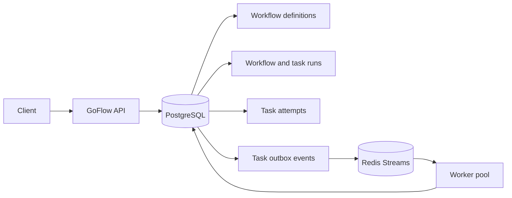
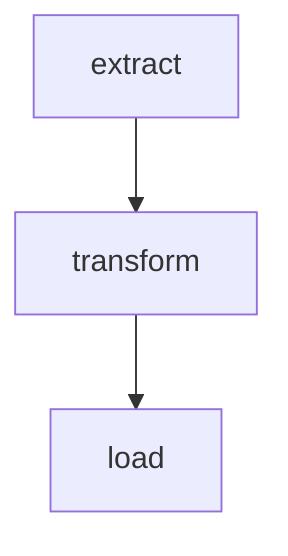
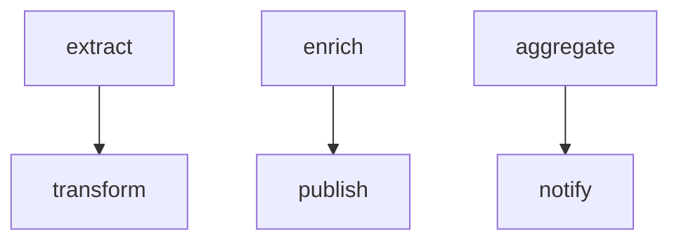
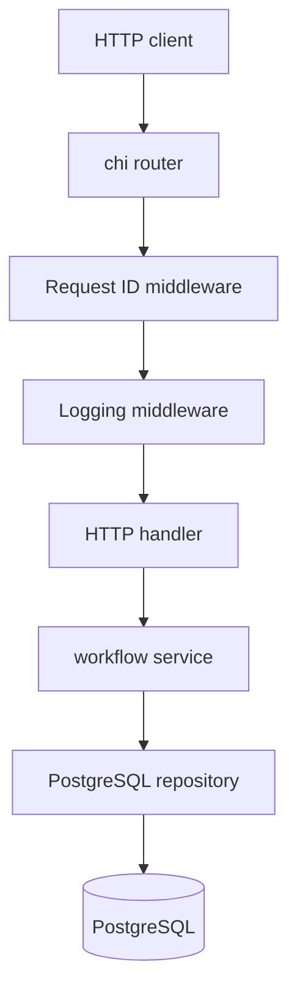
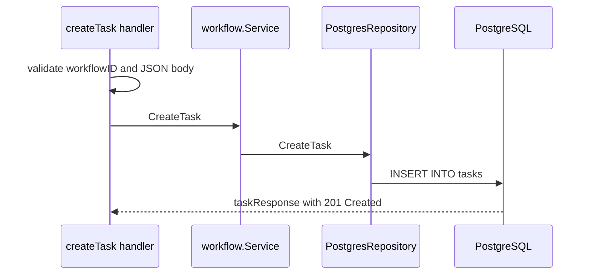
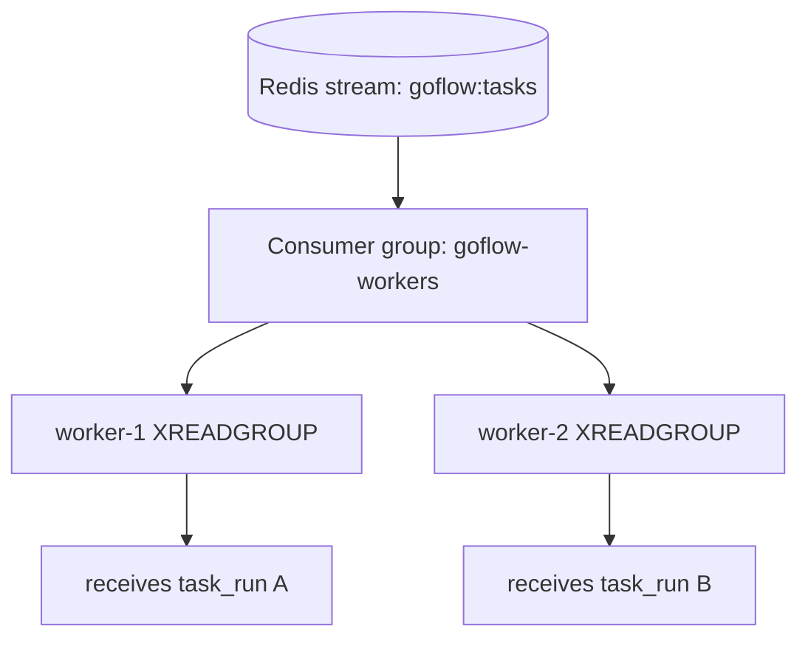
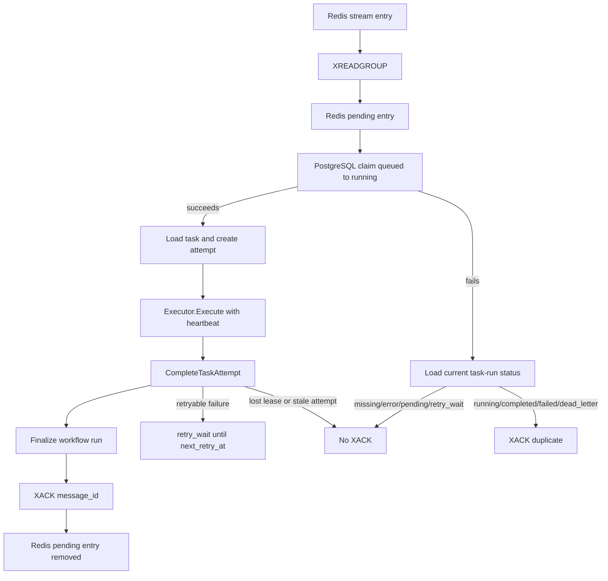
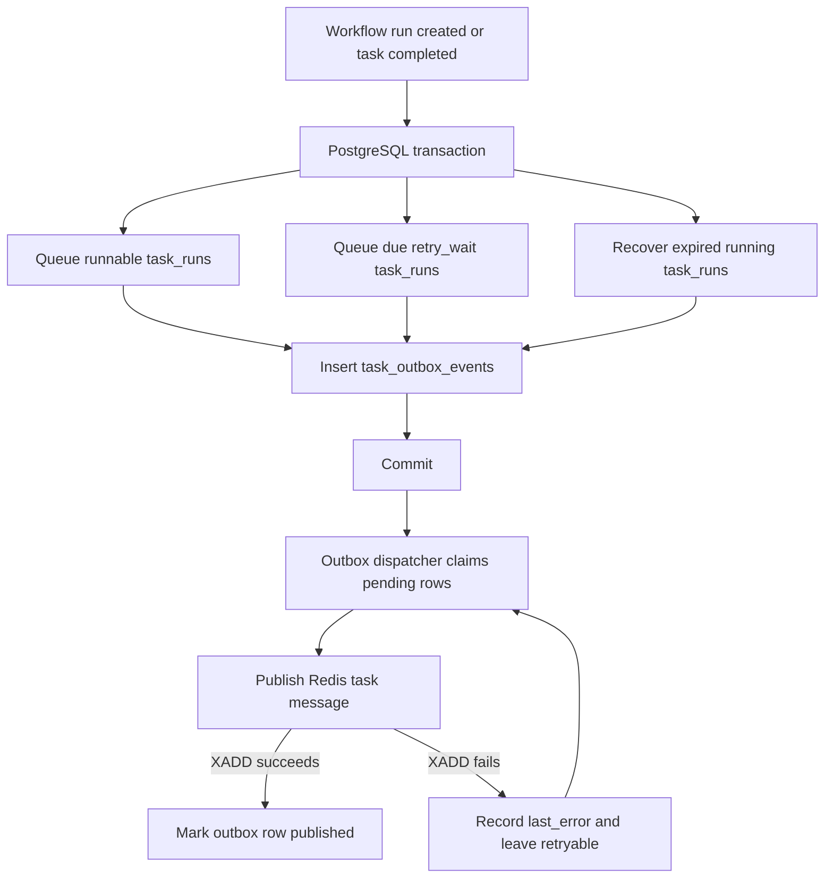

# GoFlow Architecture

## Purpose

GoFlow is a general-purpose distributed workflow orchestration engine written in Go.

It will execute dependency-based tasks across multiple workers while maintaining durable workflow state and supporting failure recovery.

## Architecture Overview



## Database Schema

PostgreSQL stores both reusable workflow definitions and runtime execution
state. The schema keeps these concepts separate so workflow structure can be
reused across many runs without overwriting execution history.


Definition tables:

- `workflows`
- `tasks`
- `task_dependencies`

Execution tables:

- `workflow_runs`
- `task_runs`
- `task_attempts`

`workflow_runs` represents one execution of a workflow definition. `task_runs`
represents one logical execution of a task inside that workflow run.
`task_attempts` records each physical retry attempt for a task run, including
attempt number, status, timestamps and failure reason.
Claimed task runs also store `locked_by`, `lease_expires_at` and
`last_heartbeat_at` so a worker can renew ownership while it executes and a
later recovery pass can reclaim work from crashed workers.

Runtime input and output values live on run tables. Definition-level schemas
and task executor configuration live on definition tables.

Composite foreign keys intentionally include `workflow_id` on dependency and
task-run relationships. This lets PostgreSQL reject cross-workflow dependencies
and task runs whose workflow run and task belong to different workflows without
using triggers.

## Workflow Graph Validation

Workflow definitions are modeled as directed acyclic graphs. Tasks are graph
nodes and `task_dependencies` rows are directed edges from predecessor task to
successor task.



Fan-out, fan-in, multiple roots, multiple leaves and disconnected components are
valid. Disconnected components are treated as separate runnable branches of the
same workflow definition.



Graph invariants:

- Every dependency edge must reference tasks in the same workflow.
- A task cannot depend on itself.
- Duplicate dependency edges are invalid.
- A valid workflow graph must be acyclic.
- A non-empty workflow must have at least one root task.
- Every task in a valid graph is reachable from at least one root task in its
  component.

The workflow package builds graphs from task IDs and dependency edges using an
adjacency list plus in-degree counts. Roots and leaves are sorted so later
scheduler logic can consume deterministic output. Cycle detection uses Kahn's
algorithm: start from zero in-degree tasks, visit successors while decrementing
their in-degree and reject the graph if the visited count is smaller than the
task count.

Dependency creation validates the graph before inserting the new edge. The
PostgreSQL repository wraps workflow-row locking, graph reads, graph validation
and dependency insertion in one transaction. Locking the workflow row with
`FOR UPDATE` serializes dependency creation for a workflow, avoiding the race
where two concurrent requests each validate against a stale graph.

PostgreSQL remains the first line of defense for invariants expressible with
constraints, such as same-workflow references, self-dependencies and duplicate
edges. Application-level graph validation covers the cycle invariant because it
requires checking the transitive dependency graph.

## Execution State Automata

GoFlow models three separate execution lifecycles. They share the same generic
transition-checking helper internally, but each lifecycle has its own typed
status values and transition table.

Workflow runs represent the aggregate outcome of one workflow execution:


Task runs represent logical task execution inside a workflow run. A task run may
fail, wait for retry, return to the queue, or move to dead-letter state after it
can no longer be retried.

The `failed` task-run state remains in the database enum for legacy rows, but
new permanent task-run failures move to `dead_letter`.


Task attempts represent one physical execution attempt. Attempts start when a
worker begins execution and then end once.


Terminal states have no outgoing transitions:

- Workflow runs: `completed`, `failed`
- Task runs: `completed`, `dead_letter`
- Task attempts: `completed`, `failed`

The workflow package rejects unknown states, same-state transitions and invalid
state changes before repository or worker code relies on them. The Go constants
are tested against the PostgreSQL enum definitions in
`migrations/001_initial_schema.up.sql`.

## API Request Flow

The API layer keeps HTTP concerns separate from workflow business logic and
PostgreSQL persistence.



Example for `POST /workflows/{workflowID}/tasks`:



Handlers own transport details such as JSON, HTTP status codes, request IDs and
response DTOs. The workflow service owns application validation and use-case
coordination. The repository owns SQL and converts database constraint failures
such as duplicate task names or missing workflows into meaningful workflow
errors.

Implemented workflow API endpoints:

| Method | Path | Responsibility |
| --- | --- | --- |
| `POST` | `/workflows` | Create a reusable workflow definition. |
| `POST` | `/workflows/{workflowID}/tasks` | Create a task definition inside one workflow. |
| `POST` | `/workflows/{workflowID}/dependencies` | Create a dependency edge between two tasks. |
| `POST` | `/workflows/{workflowID}/runs` | Create a workflow run and pending task runs transactionally. |
| `GET` | `/workflows/{workflowID}/runs/{workflowRunID}` | Read workflow-run status and input. |
| `GET` | `/workflows/{workflowID}/runs/{workflowRunID}/task-runs` | List task-run statuses for one workflow run. |
| `GET` | `/workflows/{workflowID}/runs/{workflowRunID}/task-runs/{taskRunID}/attempts` | List task attempts and failure reasons. |

Workflow-run creation accepts an optional `Idempotency-Key` header. The key is
scoped to the workflow ID for this endpoint. Repeating the same key with the
same request body returns the original workflow run; reusing the key with a
different body returns `409 Conflict`. Keys are retained indefinitely until a
cleanup policy exists.

Idempotency decisions are logged without request payloads or request hashes.
Successful replays emit `idempotency_key_reused` with request, workflow and
workflow-run IDs. Conflicts emit `idempotency_key_conflict` with request and
workflow IDs.

The API validates malformed JSON, missing required fields and invalid UUID path
parameters before calling the workflow service. Repository constraint mappings
turn database failures into stable API errors, including duplicate task names,
duplicate dependencies, missing workflows and invalid task references.
Dependency cycle validation returns a stable `dependency_cycle` error with
`400 Bad Request`.

## Task Queue

GoFlow uses Redis Streams as the initial task-delivery boundary. PostgreSQL
remains the authoritative store for workflow definitions, workflow runs, task
runs, task attempts, statuses, inputs and outputs. Redis messages are delivery
records that carry enough identifiers for worker code to load the authoritative
state from PostgreSQL.

The queue package exposes separate publishing and consuming boundaries:

```go
type TaskPublisher interface {
	PublishTask(ctx context.Context, message TaskMessage) (string, error)
}

type TaskConsumer interface {
	ReceiveTask(ctx context.Context) (ReceivedTaskMessage, error)
	AckTask(ctx context.Context, messageID string) error
	Close() error
}
```

The Redis implementation owns one Redis client per publisher and appends
messages with `XADD` to the configured stream. The returned value is the Redis
stream message ID.

Worker consumers use Redis consumer groups. A worker creates the configured
group idempotently with `XGROUP CREATE ... MKSTREAM`, then reads new messages
with `XREADGROUP` using the worker ID as the Redis consumer name. Empty reads
return a stable no-message result so workers can poll while still respecting
shutdown.



Consumer groups prevent every worker from receiving every new message. Within a
group, Redis assigns each new stream entry to one consumer. After delivery, the
message is pending for that consumer until GoFlow acknowledges it.

Task message fields are stable and explicit:

| Field | Purpose |
| --- | --- |
| `schema_version` | Message schema version. Currently `1`. |
| `workflow_id` | Workflow definition ID. |
| `workflow_run_id` | Workflow run ID. |
| `task_id` | Task definition ID. |
| `task_run_id` | Logical task run ID. |

The queue intentionally does not embed full task configuration, input payloads
or secrets. Workers use the IDs in the message to load the current task state
and task input from PostgreSQL.

Delivery semantics are at least once. Workers must be idempotent because Redis
may redeliver messages after consumer failures or acknowledgement gaps. The
current worker flow processes one message at a time:

1. Receive one Redis message.
2. Parse and validate the task message fields.
3. Claim the referenced task run in PostgreSQL by moving it from `queued` to
   `running` and setting `locked_by`, `lease_expires_at` and
   `last_heartbeat_at`.
4. Load the task definition, executor type, task config and task-run input.
5. Create a running `task_attempt`.
6. Validate task retry policy.
7. Resolve and run the configured executor while heartbeating the task-run
   lease.
8. Complete the task attempt and task run as `completed`, `dead_letter` or
   `retry_wait` only if the task run is still owned by the worker and the lease
   is active.
9. Finalize the workflow run when all task runs are terminal.
10. Acknowledge the Redis message only after completion is persisted.



Retry policy lives on task config under `retry`. Supported fields are
`max_attempts`, `initial_delay` and `multiplier`; delays use Go duration
strings. Missing policy defaults to one attempt. Invalid retry policy completes
the current attempt as failed before executor execution so a bad config cannot
loop forever.

Retry decisions use the current attempt number, parsed policy and executor
retryability. Unknown executor types and non-retryable executor failures are
permanent failures. Retryable failures with attempts remaining move the task run
to `retry_wait` and set `next_retry_at`; exhausted attempts move to
`dead_letter`.

Workflow finalization runs after each persisted attempt outcome. A workflow run
becomes `completed` once every task run is `completed`, becomes `failed` when
any task run is `dead_letter`, and stays unchanged while any task run is still
pending, queued, running or waiting for retry. Finalization is idempotent and
logs `workflow_run_finalized` when the workflow-run status changes.

If the claim fails, the worker checks PostgreSQL before acknowledging. Messages
for task runs already `running`, `completed`, `failed` or `dead_letter` are
harmless duplicates and are acknowledged without creating another attempt.
Unknown task runs, ambiguous lookup failures and non-ready states remain
pending. If completion persistence fails, the worker also leaves the message
pending so the task is not acknowledged before PostgreSQL records the outcome.
Acknowledged duplicate messages emit `duplicate_task_message` with workflow,
task, Redis message, worker, status and reason fields.

The worker extends the lease while executor code is running. If the heartbeat
cannot extend the lease, execution is cancelled and the Redis message is left
pending. Completion also checks the current attempt, task-run status,
`locked_by` and lease expiry before writing an outcome. A late worker whose
lease has already been recovered receives `task_attempt_not_completable`, and
the original Redis message is not acknowledged.

Built-in executors are intentionally small:

| Executor type | Behavior |
| --- | --- |
| `sleep` | Sleeps for a configured Go duration and returns `{"status":"completed"}`. |
| `log` | Logs a message from task config or task-run input and returns it as output. |
| `random_fail` | Fails based on `failure_probability`; useful for failure-path testing. |

Redis pending-message recovery and manual dead-letter replay remain future work.

## DAG Scheduling

The scheduler is a small coordinator between PostgreSQL workflow state and the
task outbox. It asks the workflow repository to move runnable task runs from
`pending` to `queued`, or due retry task runs from `retry_wait` to `queued`,
and write matching outbox rows in the same transaction. The dispatcher
publishes pending outbox rows to Redis and marks them `published` only after
`XADD` succeeds.



Root tasks are handled by the same query because they have no predecessor rows.
Fan-in tasks stay `pending` until every predecessor task run is `completed`.
Repeated scheduler calls are safe because already queued, running or terminal
task runs are ignored by the conditional update.
Scheduler passes that find no runnable task runs emit `scheduler_noop` with the
workflow run ID and reason.

Due-retry scheduling uses a separate repository method because retry readiness
depends on `status = retry_wait`, `next_retry_at <= now` and attempts remaining.
Future retry times, exhausted attempts and terminal task runs are ignored.
Retry queueing emits `retry_task_run_queued` and uses the same durable outbox
dispatch path as DAG scheduling.

The API triggers root scheduling after workflow-run creation commits. Worker
completion can call the same scheduler path to release newly ready successors.
The scheduler service exposes due-retry queueing, but the worker command
currently does not run a due-retry scan itself. It does dispatch existing outbox
rows and runs expired-lease recovery on `WORKER_RECOVERY_INTERVAL`. Recovery
finds `running` task runs whose leases expired, marks the open attempt failed
with `lease_expired`, clears lease fields, and moves the task run to `queued`
when attempts remain or `dead_letter` when they are exhausted. Requeued
recoveries insert task outbox rows, then use the same dispatcher path as DAG and
retry scheduling. Synchronous dispatch is an optimization. The recovery boundary
is the durable outbox row, so a later dispatcher pass can publish rows left
behind by a crash or Redis outage.
