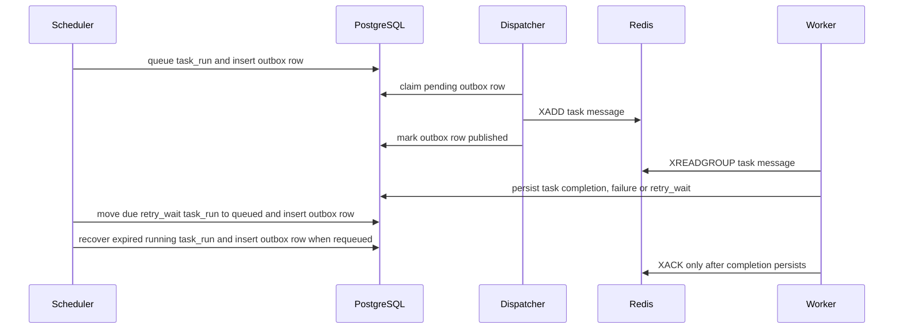

# GoFlow Failure Model

## Purpose

GoFlow treats PostgreSQL as the durable source of truth. API and worker
processes can fail, but workflow definitions, runs, task runs and retry history
must remain recoverable from persisted state.

## Current API Failure Handling

The API returns consistent JSON errors:

```json
{
  "error": "validation_error",
  "message": "request failed validation",
  "request_id": "request-id"
}
```

Every API response includes `X-Request-ID`. If the client sends a request ID,
GoFlow echoes it. Otherwise, the API generates one and uses the same value in
the response body and request log.

Current API validation failures include:

- Malformed JSON
- Empty JSON body
- Unsupported content type
- Unknown JSON fields
- Missing required fields
- Invalid UUID path parameters
- Invalid dependency task IDs

Current domain and persistence failures include:

- Unknown workflow
- Invalid task reference
- Self-dependency
- Duplicate task name inside a workflow
- Duplicate dependency
- Empty workflow run
- Reused idempotency key with a different workflow-run request
- Unexpected database or repository failure

Duplicate task names and duplicate dependencies return `409 Conflict`. Missing
workflows return `404 Not Found`. Validation errors return `400 Bad Request`.
Idempotency-key conflicts also return `409 Conflict` and are logged without the
request body or request hash.

## Database Consistency

PostgreSQL constraints prevent invalid durable state:

- Primary keys prevent duplicate identities.
- Unique constraints prevent duplicate task names, task runs and attempt
  numbers.
- Check constraints prevent invalid attempts, invalid timestamps and invalid
  failure reasons.
- Composite foreign keys prevent cross-workflow dependencies and mismatched
  task runs.

Workflow-run creation is transactional. If creating any required `task_runs`
record fails, the `workflow_runs` insert is rolled back with it.

## Retry Model

`task_runs` represents logical task execution state for one workflow run.
`task_attempts` records individual physical attempts. This preserves failure
history instead of overwriting earlier attempts when retries occur.

The API currently creates pending `task_runs` when a workflow run starts. It
does not create `task_attempts`; workers create attempts only when they actually
run tasks.

During worker execution, GoFlow creates a running `task_attempt` after a task
run is claimed. It parses task retry policy before executor execution. Invalid
retry policy completes the attempt as failed and acknowledges the Redis message
so the task does not loop forever.

Supported retry policy fields live under task `config.retry`:

- `max_attempts`
- `initial_delay`
- `multiplier`

Missing policy defaults to one attempt. Delays use Go duration strings. Jitter
is intentionally not implemented.

Successful executor output completes both the attempt and task run. Unknown
executor types and non-retryable executor failures complete the attempt and
move the task run to `dead_letter`. Retryable failures with attempts remaining
complete the attempt as failed, move the task run to `retry_wait` and store
`next_retry_at`. Exhausted retry attempts end as `dead_letter`.

The task outbox only protects scheduler-to-Redis delivery. It records queued
task messages in the same PostgreSQL transaction as the task-run state change,
then publishes them later and marks the row `published` after Redis accepts the
message. Worker acknowledgement remains tied to persisted task completion, not
outbox publication, and task side effects must still be idempotent.



The scheduler service supports the due-retry queueing step above. The worker
command dispatches existing outbox rows and runs expired-lease recovery, but it
does not periodically invoke the due-retry scan itself.

Duplicate queue messages are handled at the PostgreSQL claim boundary. If a
task run is already `running`, `completed`, `failed` or `dead_letter`, the
worker acknowledges the duplicate Redis message without creating another
attempt. Unknown task runs, ambiguous lookup failures and non-ready states stay
pending. Duplicate acknowledgements are logged with workflow, task, Redis
message, worker and reason fields.

Permanent task failures use `dead_letter` as the terminal logical task-run
state. Failed task attempts keep the failure reason; task runs do not duplicate
the full attempt history. Dead-lettered task runs are not automatically retried.
After each persisted task outcome, workflow finalization marks the workflow run
`completed` when all task runs completed or `failed` when any task run
dead-lettered. API clients can inspect the workflow run, its task runs and task
attempt failure reasons through the read endpoints.

## Worker Leases And Recovery

Workers process tasks with at-least-once delivery semantics. Task execution
must be idempotent or guarded against duplicate side effects.

Claiming a queued task run records the worker in `locked_by`, sets
`lease_expires_at` and stores `last_heartbeat_at`. While the executor runs, the
worker periodically extends the lease. If lease extension fails, the worker
cancels execution and leaves the Redis message pending.

Expired-lease recovery runs in the worker process on
`WORKER_RECOVERY_INTERVAL`. It finds `running` task runs whose leases expired
using PostgreSQL row locks with `SKIP LOCKED`, marks the open attempt failed
with `lease_expired`, clears lease fields and then either requeues the task run
or moves it to `dead_letter` when attempts are exhausted. Requeued task runs get
a task outbox row and are published through the same dispatcher path as normal
scheduling.

Late worker completion is rejected if the task run is no longer `running`, the
attempt is no longer running, the worker no longer owns `locked_by`, or the
lease is expired. In those cases completion returns
`task_attempt_not_completable` and the worker does not acknowledge the original
Redis message.

Manual dead-letter replay remains future work.
