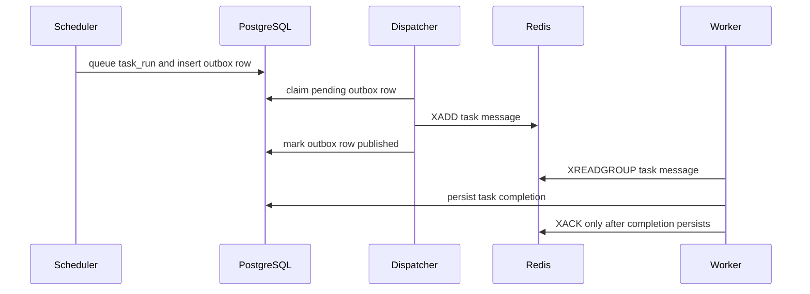

# GoFlow Failure Model

## Purpose

GoFlow treats PostgreSQL as the durable source of truth. API and worker
processes can fail, but workflow definitions, runs, task runs and retry history
must remain recoverable from persisted state.

## Current API Failure Handling

The API returns consistent JSON errors:

```json
{
  "error": "validation_error",
  "message": "request failed validation",
  "request_id": "request-id"
}
```

Every API response includes `X-Request-ID`. If the client sends a request ID,
GoFlow echoes it. Otherwise, the API generates one and uses the same value in
the response body and request log.

Current API validation failures include:

- Malformed JSON
- Empty JSON body
- Unsupported content type
- Unknown JSON fields
- Missing required fields
- Invalid UUID path parameters
- Invalid dependency task IDs

Current domain and persistence failures include:

- Unknown workflow
- Invalid task reference
- Self-dependency
- Duplicate task name inside a workflow
- Duplicate dependency
- Empty workflow run
- Reused idempotency key with a different workflow-run request
- Unexpected database or repository failure

Duplicate task names and duplicate dependencies return `409 Conflict`. Missing
workflows return `404 Not Found`. Validation errors return `400 Bad Request`.
Idempotency-key conflicts also return `409 Conflict` and are logged without the
request body or request hash.

## Database Consistency

PostgreSQL constraints prevent invalid durable state:

- Primary keys prevent duplicate identities.
- Unique constraints prevent duplicate task names, task runs and attempt
  numbers.
- Check constraints prevent invalid attempts, invalid timestamps and invalid
  failure reasons.
- Composite foreign keys prevent cross-workflow dependencies and mismatched
  task runs.

Workflow-run creation is transactional. If creating any required `task_runs`
record fails, the `workflow_runs` insert is rolled back with it.

## Retry Model

`task_runs` represents logical task execution state for one workflow run.
`task_attempts` records individual physical attempts. This preserves failure
history instead of overwriting earlier attempts when retries occur.

The API currently creates pending `task_runs` when a workflow run starts. It
does not create `task_attempts`; workers create attempts only when they actually
run tasks.

During worker execution, GoFlow creates a running `task_attempt` after a task
run is claimed. Successful executor output completes both the attempt and task
run. Executor errors, unknown executor types and explicit executor failure
reasons complete both records as failed. Redis acknowledgement happens only
after the completion update succeeds.

The task outbox only protects scheduler-to-Redis delivery. It records queued
task messages in the same PostgreSQL transaction as the task-run state change,
then publishes them later and marks the row `published` after Redis accepts the
message. Worker acknowledgement remains tied to persisted task completion, not
outbox publication, and task side effects must still be idempotent.



Duplicate queue messages are handled at the PostgreSQL claim boundary. If a
task run is already `running`, `completed`, `failed` or `dead_letter`, the
worker acknowledges the duplicate Redis message without creating another
attempt. Unknown task runs, ambiguous lookup failures and non-ready states stay
pending. Duplicate acknowledgements are logged with workflow, task, Redis
message, worker and reason fields.

## Planned Worker Failure Handling

Later phases will add worker leases, retries and dead-letter handling. The
planned model is:

- Workers process tasks with at-least-once delivery semantics.
- Task execution must be idempotent or guarded against duplicate side effects.
- Workers heartbeat while holding task leases.
- Expired leases allow another worker to recover unfinished work.
- Retry policy records each attempt and eventually moves exhausted work to a
  dead-letter state.
