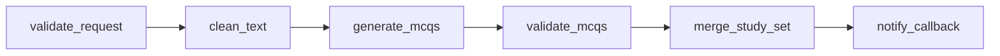

# Recallify Workflow

GoFlow includes a Recallify-style workflow that validates input, prepares text,
generates multiple-choice questions, validates model output, builds a study set
and optionally posts a callback.

The feature contract, client, executors and shared template live in
`internal/recallify`. Both the standalone command and HTTP demo use that
template.



## Prerequisites

- Go version from `go.mod`
- Docker with Compose
- `.env` created from `.env.example`
- Recallify running only for real-backend mode

Start PostgreSQL and Redis:

```sh
cp .env.example .env
make postgres-up
make redis-up
```

## Deterministic Local Demo

The local command creates the six-task workflow, starts in-process workers and
uses a deterministic fake generation server:

```sh
go run ./cmd/recallify -runs 2 -workers 2 -timeout 90s
```

It prints started, completed and failed workflow runs, validation passes,
attempts, retries, dead letters, duration percentiles and pending outbox events.
A successful run has two completed runs, two validation passes, no failures, no
dead letters and no pending outbox events.

Use another text fixture with `-fixture`. The repository fixture is
`examples/recallify/go-notes.txt`. An empty or missing fixture fails before any
workflow is created.

## Recallify Backend Mode

Point the same command at a running Recallify backend:

```sh
go run ./cmd/recallify \
  -runs 1 \
  -workers 2 \
  -timeout 120s \
  -recallify-url http://localhost:8080 \
  -fixture examples/recallify/go-notes.txt
```

This calls `POST /ai/generateMcqs`. The standalone command does not add an
authorization token. For an authenticated Recallify deployment, run the GoFlow
API and worker, then use the example script:

```sh
make api
make worker
RECALLIFY_URL=http://localhost:8080 \
RECALLIFY_TOKEN='<token>' \
examples/recallify/run-real.sh
```

Alternatively set `RECALLIFY_EMAIL` and `RECALLIFY_PASSWORD`; the script logs
in through `/api/user/login` and uses the returned access token. Do not commit
credentials or tokens.

The API route `POST /demos/recallify/runs` creates and queues a new Recallify
workflow. Its response contains `workflow_id` and `workflow_run_id`; inspect the
result at `GET /workflows/{workflowID}/runs/{workflowRunID}`.

## Input And Output

Required input:

```json
{"document_text":"notes to study"}
```

Optional fields are `title`, `level` (`easy`, `medium` or `hard`), `mcq_count`,
`callback_url` and `external_request_id`. Defaults are `Untitled Study Set`,
`medium` and `10` questions.

Generated MCQs must be a JSON array with the requested count. Each item needs a
non-empty question, four distinct non-empty options, four explanations and an
integer answer from 1 through 4. Duplicate question stems are rejected. The
workflow output is the final callback task output; when no callback URL is
provided it records that notification was skipped.

## Failure Behavior

- HTTP `429`, `500`, `502`, `503`, `504` and request timeouts are retryable.
- Other HTTP `4xx`, invalid configuration and invalid response shapes are not
  retryable.
- Invalid MCQ JSON is rejected before merge and is not retried by the validator.
- Callback `429` and `5xx` responses are retryable; other `4xx` responses are
  permanent failures.
- Document text, generated answers, bearer tokens and callback payload content
  are not written to application logs.

For a failed run, generate an evidence report:

```sh
go run ./cmd/incidentreport -run <workflow-run-id> \
  -metrics-url http://localhost:8081/metrics
```

## Limitations

- The API demo creates a new workflow definition for each request.
- Document text and generated output remain in PostgreSQL JSON columns; there
  is no external artifact store.
- The standalone demo supports one fixture per invocation.
- AI calls are at least once and may be repeated after ambiguous failures.
- The worker has no automatic pending-message replay command.
